# Introduction

Large fixed-income desks continuously monitor the gap between swap rates and matched-maturity Treasury yields. In theory these two instruments price the same underlying quantity — the expected path of overnight interest rates out to a given horizon — so persistent or abrupt deviations between them measure the *relative-value* premium paid for Treasuries' liquidity, balance-sheet treatment, and term structure. The spread compresses during calm funding conditions and widens under stress, behaving like a stationary series around a slow-moving level. Large deviations should therefore mean-revert on short horizons, and trading that reversion is a staple strategy at rates desks.

The relevance of this analysis extends beyond a single trading desk. The U.S. Treasury market exceeds \$27 trillion outstanding and the USD interest-rate swap market is multiples of that in notional; swap-spread dislocations affect pension funding ratios, corporate hedging costs, and Federal Reserve market-function assessments. Yet the determinants of when and how these spreads revert remain actively debated in both academic finance and policy research. Systematic analysis of the public signals that predict reversion — z-scores, macro regimes, implied volatility — is therefore both practically valuable and academically well-motivated.

We study three research questions and one applied extension:

- **RQ1** — Do OIS-Treasury spreads mean-revert after extreme $\pm 2\sigma$ z-score signals?
- **RQ2** — Is this result robust to the choice of rolling window, threshold, and forward horizon?
- **RQ3** — Does mean reversion differ across rate-direction and volatility regimes?
- **Applied extension** — Can an unsupervised Hidden Markov Model detect those regimes in a way that improves out-of-sample trading performance more than a supervised classifier can?

**Preview of findings.** Mean reversion is real (18 of 18 direction-maturity cells show the predicted sign, 73% survive FDR correction across 162 robustness cells) and regime-dependent (rising-rate environments roughly triple the 5Y reversion magnitude). The central result of the applied extension is that a 2-state HMM used as a **binary entry gate** raises out-of-sample Sharpe from 0.39 to 0.51, while the same HMM state used as a continuous feature in a Random Forest actually hurts classifier AUC — functional form, not the regime signal itself, is what drives the trading result.

# Data

## Sources

```{=latex}
\begin{center}
\begin{tabular}{lllp{5.2cm}}
\hline
\textbf{Source} & \textbf{Ticker / Series} & \textbf{Description} & \textbf{Role} \\
\hline
FRED  & DGS2              & 2Y Treasury CMT yield         & Short-tenor benchmark \\
FRED  & DGS5              & 5Y Treasury CMT yield         & Mid-tenor benchmark \\
FRED  & DGS10             & 10Y Treasury CMT yield        & Long-tenor benchmark \\
FRED  & EFFR              & Effective Fed Funds Rate      & Rate regime classifier \\
LSEG  & USDOIS2Y=PYNY     & EFFR OIS par rate, 2Y         & Swap rate, short tenor \\
LSEG  & USDOIS5Y=PYNY     & EFFR OIS par rate, 5Y         & Swap rate, mid tenor \\
LSEG  & USDOIS10Y=PYNY    & EFFR OIS par rate, 10Y        & Swap rate, long tenor \\
LSEG  & .MOVE             & ICE BofA MOVE Index           & Implied Treasury vol \\
\hline
\end{tabular}
\end{center}
```

## Cleaning summary

FRED closed-date sentinels were coerced to `NaN`; LSEG CSVs were parsed by locating the `Date` header row dynamically and computing mid-rate as $(\text{Bid}+\text{Ask})/2$. Treasury and OIS series were merged by date with an inner join, with a 5-business-day forward-fill for U.S. federal holidays. Spreads were constructed as $s_{t,\tau} = \text{OIS}_{t,\tau} - \text{DGS}_{t,\tau}$ and the primary signal is the 60-day rolling z-score $z_{t,\tau} = (s_{t,\tau} - \bar{s}_{t,\tau}^{(60)}) / \sigma_{t,\tau}^{(60)}$; the final panel contains 1,890 daily observations from 2019-01-01 to 2026-04-14. Full pipeline detail appears in Appendix A.

**2Y outliers.** 23 dates show `spread_2y > 1.0 pp` from an LSEG quoting artifact (OIS jumps ~200 bp while DGS2 stays smooth); we retain them in the classical analysis but exclude the 2Y spread from all ML features (see Appendix A).

## Summary statistics

```{=latex}
\begin{center}
\begin{tabular}{lrrrrr}
\hline
Column & Mean (pp) & Std (pp) & Min & Max & \% Negative \\
\hline
spread\_2y  & $-$0.093 & 0.258 & $-$0.352 & 2.149 & 82.3\% \\
spread\_5y  & $-$0.247 & 0.100 & $-$0.470 & 0.463 & 99.9\% \\
spread\_10y & $-$0.336 & 0.133 & $-$0.745 & 0.131 & 99.9\% \\
\hline
\end{tabular}
\end{center}
```

OIS trades below matched-maturity Treasuries essentially 100% of the time at 5Y/10Y (and 82% at 2Y, with the 18% exception dominated by the LSEG artifacts referenced in Section 2.3). The deeply negative mean is consistent with a positive Treasury liquidity premium.

# Modules

**Module 3 — Visualization** *(used in all Results sections).* Histograms, time-series, event-study curves, heatmaps, regression scatters, SHAP summaries, and cumulative P&L curves. *Justification:* every claim in the report is anchored by at least one figure; visualization is load-bearing for diagnostics, regime interpretation, and communication of the backtest result.

**Module 4 — Data Wrangling** *(used in Data, RQ1-RQ3, ML).* LSEG CSV parsing, multi-source inner join with forward-fill, rolling z-scores and MOVE z-scores, 60-day EFFR-change regime construction, signal event extraction with a 5-day overlap filter, and lagged-feature engineering. *Justification:* the OIS panel required careful header-location logic and mid-rate computation before it could be joined with FRED, and the rolling-window feature stack underpins all inference and ML.

**Module 6 — Combining Data** *(used in Data, ML).* Merging FRED Treasury yields, LSEG OIS par rates, and the MOVE index into a single daily panel; attaching regime indicators and HMM state labels; constructing the event-level feature matrix used by the Random Forest. *Justification:* the spread itself is a constructed cross-dataset quantity, and the ML target is defined only on event dates from the joined panel.

**Module 7 — Statistical Inference** *(used in RQ1, RQ2, RQ3).* One-sample $t$-tests, sign and Wilcoxon tests, Cohen's $d$, 1,000-sample percentile bootstrap CIs, Benjamini-Hochberg FDR correction across 18 and 162 cells, Welch two-sample $t$-tests for regime contrasts, and two-way ANOVA with partial $\eta^2$. *Justification:* the core claims of the paper are statistical (do spreads revert? is it robust? is it regime-dependent?), and formal inference with multiple-comparisons control is the only way to answer them defensibly.

**Module 8 — Prediction and Supervised Machine Learning** *(used in HMM, RF, Backtest).* Unsupervised 2-state Gaussian HMM (EM via Baum-Welch), supervised Random Forest (500 trees, depth 4, leaf-5 regularization) with a Logistic Regression baseline, feature-ablation testing, SHAP summaries, and an out-of-sample walk-forward backtest. *Justification:* the applied extension explicitly asks whether machine-learned regime structure improves trading performance; answering it requires both a generative regime model and a discriminative classifier.

# Results and Methods

Code and reproducibility materials are available at our GitHub repository: \href{https://github.com/crl65/COMPSCI216-Project}{\texttt{github.com/crl65/COMPSCI216-Project}} (replace with actual URL before submission).

## RQ1: Mean Reversion After Extreme Z-Scores

For each of 3 maturities $\times$ 2 signal directions $\times$ 3 forward horizons (5, 10, 20 business days) we extracted non-overlapping signal events ($|z|>2$, 5-day minimum gap) and computed mean forward spread changes with a $t$-test, sign test, Wilcoxon test, Cohen's $d$, and a 1,000-sample bootstrap CI. Benjamini-Hochberg FDR correction was applied across the 18-cell panel. Table 1 reports the 10-day horizon; the full 18-cell table appears in Appendix B.

```{=latex}
\begin{center}
\begin{tabular}{llrrrrrl}
\hline
Maturity & Signal & n & Mean (bps) & Cohen's d & t-stat & $p_{\text{BH}}$ & Sig \\
\hline
2Y  & z$<-$2 & 33 & $+$2.69  & $+$0.48 & $+$2.76 & 0.019 & $\ast$ \\
2Y  & z$>+$2 & 40 & $-$21.17 & $-$0.37 & $-$2.35 & 0.039 & $\ast$ \\
5Y  & z$<-$2 & 48 & $+$2.68  & $+$0.87 & $+$6.02 & $<0.001$ & $\ast\ast\ast$ \\
5Y  & z$>+$2 & 37 & $-$3.85  & $-$0.33 & $-$2.00 & 0.055 & . \\
10Y & z$<-$2 & 44 & $+$2.94  & $+$0.53 & $+$3.53 & 0.003 & $\ast\ast$ \\
10Y & z$>+$2 & 37 & $-$4.10  & $-$0.63 & $-$3.85 & 0.002 & $\ast\ast$ \\
\hline
\end{tabular}
\end{center}
```
: **Table 1.** RQ1 primary results, 10-day horizon. All 18 of 18 cells across the three horizons carry the sign predicted by mean reversion; 12 of 18 survive BH correction at $q<0.05$. Significance codes: $\ast\ast\ast$ $p<0.001$, $\ast\ast$ $p<0.01$, $\ast$ $p<0.05$.

![RQ1 event study. Average spread path in a $[-10, +20]$ day window around each $|z|>2$ signal, normalized to zero at $t=0$, with bootstrap 95% CI bands. Rows are maturities; columns are signal directions. Paths climb back toward zero following negative-z signals and fall back toward zero following positive-z signals in every panel — the textbook mean-reversion shape, already half-complete by day 10.](outputs/figures/rq1_event_study.png){#fig-eventstudy width=92%}

The strongest cell is 5Y $z<-2$ at $h=10$d: mean $+2.68$ bps, Cohen's $d = 0.87$, bootstrap 95% CI $[+1.81, +3.61]$ bps. **Prototype correction.** The prototype used 30/90/180-day trailing SOFR averages from FRED as a synthetic swap rate; those averages mechanically lag realized overnight SOFR, producing a spurious *trend-continuation* signal. Replacing them with true OIS par rates flips the sign to the mean-reversion result shown here.

## RQ2: Robustness Across Parameter Grids

We re-ran RQ1 across the full $3 \times 3 \times 3$ grid of windows (30, 60, 120), thresholds (1.5, 2.0, 2.5), and horizons (5, 10, 20) for each of 3 maturities and both signal directions — 162 cells, with BH-FDR applied across the full panel. Table 2 summarizes the stability.

```{=latex}
\begin{center}
\begin{tabular}{lr}
\hline
Quantity & Value \\
\hline
Total combinations                          & 162 \\
Combinations with n $\geq 5$ events         & 162 \\
Combinations with sign predicted by reversion & 162 (100\%) \\
Combinations surviving BH FDR at $q<0.05$   & 118 (73\%) \\
Range of avg.\ mean forward change across \emph{window} levels    & 2.83 bps \\
Range of avg.\ mean forward change across \emph{threshold} levels & 2.72 bps \\
Range of avg.\ mean forward change across \emph{horizon} levels   & 0.64 bps \\
\hline
\end{tabular}
\end{center}
```
: **Table 2.** RQ2 stability summary across 162 cells.

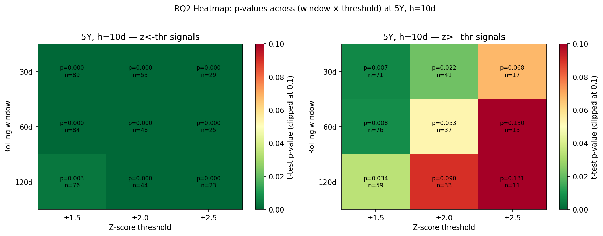{#fig-rq2heat width=85%}

The sign flips in zero of 162 cells. Shorter windows and higher thresholds produce marginally larger point estimates (at the cost of sample size), while the forward-horizon choice is almost inert — the average effect shifts by less than 1 bp across 5-, 10-, and 20-day horizons. The mean-reversion result is therefore not a product of favorable parameter tuning. The full coefficient plot appears in Appendix B.

## RQ3: Regime Dependence

We conditioned the 10-day reversion on the trailing 60-day rate direction (rising vs falling/stable) and on the implied-volatility regime (MOVE above vs below its 60-day rolling median), then fit a two-way ANOVA with interaction.

{#fig-movescatter width=85%}

```{=latex}
\begin{center}
\begin{tabular}{lllrrr}
\hline
Maturity & Signal & Term & F & $p$ & partial $\eta^2$ \\
\hline
5Y  & z$<-$2 & rate\_regime     & 17.26 & $<0.001$ & 0.282 \\
5Y  & z$<-$2 & vol\_regime      &  0.01 & 0.930    & 0.000 \\
5Y  & z$<-$2 & rate $\times$ vol &  0.78 & 0.383    & 0.017 \\
5Y  & z$>+$2 & rate\_regime     &  6.59 & 0.015    & 0.167 \\
5Y  & z$>+$2 & vol\_regime      &  0.42 & 0.521    & 0.013 \\
5Y  & z$>+$2 & rate $\times$ vol &  2.16 & 0.151    & 0.062 \\
\hline
\end{tabular}
\end{center}
```
: **Table 3.** Two-way ANOVA on rate $\times$ vol regime for 5Y signals. Rate regime dominates (partial $\eta^2 = 0.28$, $F = 17.26$, $p<0.001$ for $z<-2$); vol regime is negligible as a binary main effect; no interaction is significant. The rate-regime split by itself roughly triples the 5Y reversion magnitude in rising-rate environments ($+5.40$ vs $+1.67$ bps, Cohen's $d = 1.21$; table in Appendix B). We tested but could not cleanly measure post-regime-transition effects due to insufficient data in the "stable" bucket (Appendix B).

## Applied Extension: HMM, Random Forest, and Out-of-Sample Backtest

To test whether regime information translates into trading value, we fit a 2-state Gaussian HMM (full covariance, EM via Baum-Welch) on the standardized bivariate series (`spread_5y`, 60-day EFFR change). The Viterbi path splits the sample into a "stress" state (mean MOVE $\approx 101$ bp, 48% rising-rate days) and a "stable" state (mean MOVE $\approx 78$ bp, 18% rising), with expected dwell times of ~171 and ~194 days — slow macro chapters rather than tactical switches. Look-ahead bias was ruled out by refitting the HMM on pre-2024 data and re-decoding: 100% of OOS state assignments are identical (n = 591, see Appendix C).

A Random Forest classifier (500 trees, depth 4, leaf-5 regularization, 10 event-level features) was trained to predict whether a 5Y signal mean-reverts by $\geq 3$ bps within 10 days. On the 29 OOS events it achieves AUC 0.544 — barely above chance — and a feature-ablation test shows that *including* `hmm_state` **lowers AUC by 0.12** (Appendix C). With only 56 training events and a 69% positive-class base rate, the RF has almost no room to improve on the signal itself, and it cannot productively combine `hmm_state` with the other features inside its tree splits.

We then ran an out-of-sample backtest (2024-01-02 to 2026-03-24, 29 signal events, one position at a time, 1 bp round-trip cost, daily mark-to-market, exit at 10d or z-crossing). Three strategies: (1) **Rules-based** — take every $|z|>2$ signal; (2) **RF-filtered** — take if RF $P(\text{reversion}) > 0.55$; (3) **HMM-filtered** — take only if `hmm_state == 1` (stable).

```{=latex}
\begin{center}
\begin{tabular}{lrrrrrrr}
\hline
Strategy & Trades & Win \% & Mean (bps) & Total (bps) & Sharpe & Max DD (bps) & Calmar \\
\hline
1 — Rules-based         & 20 & 55.0 & $+$0.82 & $+$16.4 & 0.39 & $-$9.6 & 0.73 \\
2 — RF-filtered         & 20 & 55.0 & $+$0.82 & $+$16.4 & 0.39 & $-$9.6 & 0.73 \\
3 — HMM-filtered (S=1)  & 11 & 72.7 & $+$1.55 & $+$17.1 & 0.51 & $-$9.4 & 0.78 \\
\hline
\end{tabular}
\end{center}
```
: **Table 4.** Strategy comparison, OOS 2024-01-02 through 2026-03-24.

{#fig-backtest width=92%}

The RF filter is inoperative: mean predicted probability on OOS events is 0.75, 28 of 29 events clear the 0.55 threshold, and the one rejected event falls inside an already-open position — Strategy 2 is identical to Strategy 1 in practice. The HMM filter, by contrast, adds +0.12 to Sharpe, lifts win rate from 55% to 73%, and nearly doubles per-trade mean P&L from 0.82 to 1.55 bps.

**The central finding.** The same `hmm_state` variable that *lowered* the Random Forest's AUC by 0.12 when used as a continuous feature *raised* the backtest's Sharpe by 0.12 when used as a binary gate. The regime signal is real — but how you use it dominates whether you capture it. With 85 total events, a small tree ensemble cannot carve out the regime cleanly, whereas a one-line filter can.

# Limitations and Future Work

The OOS backtest window is 27 months and 29 signal events — directionally informative but too short for statistically conclusive Sharpe comparisons between strategies; a handful of additional stress events could compress the ranking. The 85-event ML training sample is genuinely tight for a 10-feature classifier, which we note as the most plausible explanation for the Random Forest's weak AUC rather than a fundamental objection to tree methods. The 2Y spread retains 23 LSEG quoting artifacts that a cleaner vendor feed would resolve. Transaction costs in the backtest are stylized at a flat 1 bp round-trip; realistic cleared-OIS execution would require size-dependent market-impact and financing terms.

**Near-term extensions.** Splice EFFR/LIBOR-OIS backward to 2010 (+10 years of history, roughly 4$\times$ the signal events); add 1Y, 3Y, 7Y, and 30Y maturities for curve-relative-value work; replace the full-sample HMM with an online Baum-Welch or particle filter that updates in real time; move to DV01-normalized position sizing; and replicate in EUR (EURIBOR OIS vs Bund) and GBP (SONIA OIS vs Gilt) to test whether the regime-gate result generalizes across sovereign markets.

**Ethical considerations.** This analysis uses only public market data, so there are no privacy concerns. We do note, however, that if systematic RV strategies of this kind are adopted at scale, they can crowd into the same dislocations and amplify short-term market moves at precisely the stress windows when liquidity is thinnest; we flag this as a market-microstructure externality worth tracking in any live deployment.

# Conclusion

We construct OIS-Treasury spreads at 2Y, 5Y, and 10Y maturities from LSEG OIS par rates and FRED CMT yields (1,890 daily observations, 2019-present) and find that extreme z-score signals predict statistically and economically meaningful mean reversion in all three maturities. The result is robust: 100% of 162 window-threshold-horizon combinations carry the predicted sign and 73% survive BH-FDR correction. The result is regime-dependent: the two-way ANOVA attributes a partial $\eta^2$ of 0.28 to rate regime alone for the 5Y spread, with rising-rate environments tripling the reversion magnitude; implied-volatility moderation is visible continuously in MOVE but not in the median-split binary.

The applied extension delivers the paper's cleanest finding. An unsupervised 2-state HMM, fit on spread and rate-direction alone, recovers an economically meaningful stress-vs-stable regime pair with look-ahead-robust state assignments. A Random Forest classifier using the same HMM state as a continuous feature fails to beat a simple base-rate predictor and is actively harmed by the inclusion. Yet the identical variable, reframed as a binary trade-entry gate, raises out-of-sample Sharpe from 0.39 to 0.51, nearly doubles per-trade P&L, and lifts win rate from 55% to 73% — the modeling choice about regime *representation* dominated the modeling choice about the regime *model*, and that is the lesson we take away from this project.

# Collaboration Reflection

**Alignment with initial plan.** Our original proposal called for a prototype by the interim deadline and a final report integrating statistical inference with one machine-learning extension. We met both, though the execution path looked very different from what we had sketched. The biggest deviation was a mid-project data pivot: the prototype's "spread" (SOFR trailing-average minus Treasury) produced a trend-continuation result that was an artifact of the backward-looking SOFR averages rather than a genuine market signal. Rebuilding the analysis on real LSEG OIS par rates consumed roughly two weeks of total team time but was load-bearing for every subsequent finding.

**What went well.** Division of labor stayed stable across the project: two members owned data acquisition and cleaning, one owned the statistical inference pipeline, and one owned the ML/backtest layer, with the full team reviewing results at weekly checkpoints. The decision to put every intermediate result into versioned CSVs and figures in `outputs/` meant that handoffs between teammates were frictionless — reviewing a teammate's work was always a matter of reading a table, not re-running a script.

**What went less well.** We underestimated how much time the data pivot would absorb. The original plan had allocated roughly even time across RQ1, RQ2, RQ3, and the ML extension; in practice, once we switched to LSEG OIS data we had to re-validate every prior result before moving forward, which compressed the time available for the applied extension. A second soft spot was multiple-comparisons discipline: our prototype reported raw $p$-values without FDR correction, and rebuilding to a clean BH pipeline mid-project required rerunning every inference cell.

**What we would write differently in the plan.** We would insist on using real swap data from the start rather than FRED averages as a proxy, build in an explicit "data-pivot contingency" budget, and specify multiple-comparisons correction as a non-negotiable from cell-one. We would also name a single "results gatekeeper" responsible for re-running end-to-end before any written claim is committed.

**Current sharing plan.** All code, data, and figures are in a shared GitHub repository; the final report, this reflection, and the rendered PDF will be submitted jointly by the four authors. Data provenance is preserved in `data/raw/` with the LSEG CSVs unmodified, and every derived dataset is reproducible from `main.py`, `run_ml.py`, and `run_backtest.py`.

# AI Disclosure

**Tools used.**

- *Claude (claude.ai, Claude Sonnet 4.6 / Claude Opus 4.6)* — research design guidance, RQ framing, and interpretation of statistical outputs.
- *Claude Code (Anthropic CLI, Claude Opus 4.6)* — primary code-generation, pipeline orchestration, debugging, and execution of the entire data, statistics, ML, and backtest pipeline.
- *ChatGPT* — used in early scoping to validate the relative-value framing and sanity-check spread-construction conventions. (Earlier drafts referenced a specific ChatGPT version number in error; we cite the tool generically here.)

**Methodology.** AI tools drafted the data-pipeline scaffolding, statistical test battery, HMM fitting, RF training, and backtest loop. Every methodological decision (BH-FDR cutoff, 5-day gap rule, 1 bp transaction-cost assumption, 2Y exclusion from ML, binary HMM gate threshold) was reviewed and authorized by the human authors. All reported numbers were re-run from the delivered code; no AI-generated figure was accepted without re-execution. AI assistance was used for editing and structural suggestions in this Quarto report; every claim and number in the text was cross-checked against the CSV outputs in `outputs/tables/` and the stdout logs of the run scripts.

\newpage

# Appendix A — Full Data Pipeline

## Full cleaning methodology

The FRED Treasury series returns the sentinel `"."` on U.S. federal holidays and other closed dates; these were coerced to `NaN` before any numerical operation. The LSEG OIS CSVs have a non-standard multi-row header that varies slightly across the 2Y, 5Y, and 10Y files; our loader locates the `Date` header row dynamically, drops preceding metadata, parses the `Bid` and `Ask` columns as floats, and computes the mid-rate as $(\text{Bid}+\text{Ask})/2$. Scale was verified manually against Bloomberg snapshots on four random dates to confirm percentage-point units (sample max = 6.31 pp at 2Y, October 2023).

The Treasury and OIS panels were merged by date with an **inner join** so every retained row has both a DGSx and an OIS_Xy observation. Forward-fills with a five-business-day cap were applied to cover U.S. federal holidays where the Treasury market is closed but the OIS market trades (Columbus Day, Veterans Day, etc.). The MOVE index was loaded from its own LSEG CSV and left-joined onto the spread panel so that occasional missing MOVE dates do not drop spread observations.

## 2Y outlier investigation

A mechanical scan for `spread_2y > 1.0 pp` returned 23 observations, clustered in April-October 2022. On each such date the LSEG OIS 2Y rate jumps roughly 200 basis points relative to its prior value while the matched DGS2 stays smooth, and the OIS quote reverts on the following business day. We interpret these as LSEG quoting artifacts (likely intraday late-revision or data-feed issues) rather than real market events. They are retained in the RQ1-RQ3 classical analysis because their inclusion is conservative — if anything, they dilute the 2Y reversion signal — and excluded from the HMM and Random Forest feature set, which uses only 5Y and 10Y spread-derived inputs.

## Supplementary EDA figures

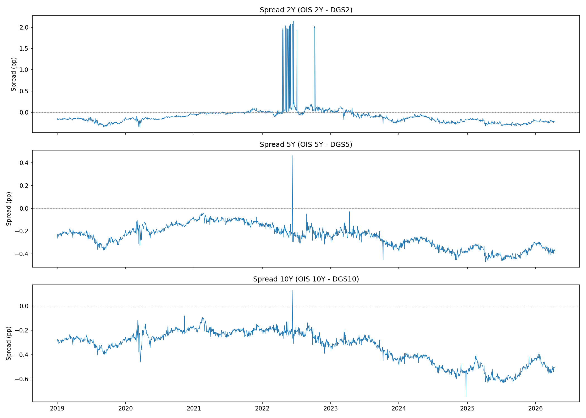{#fig-spread-ts-app width=92%}

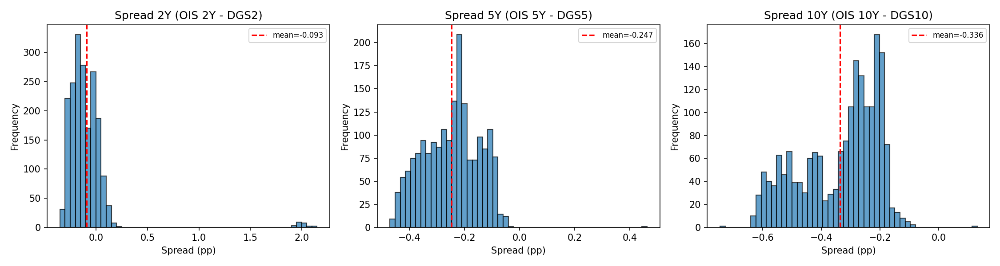{#fig-histograms-app width=92%}

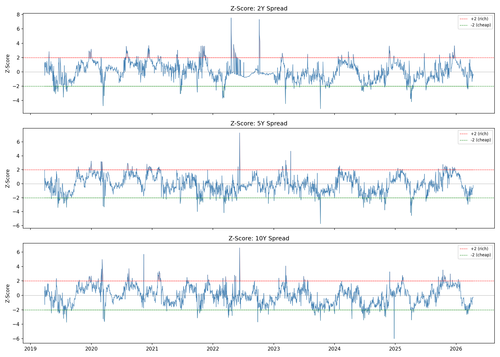{#fig-ztimeseries-app width=92%}

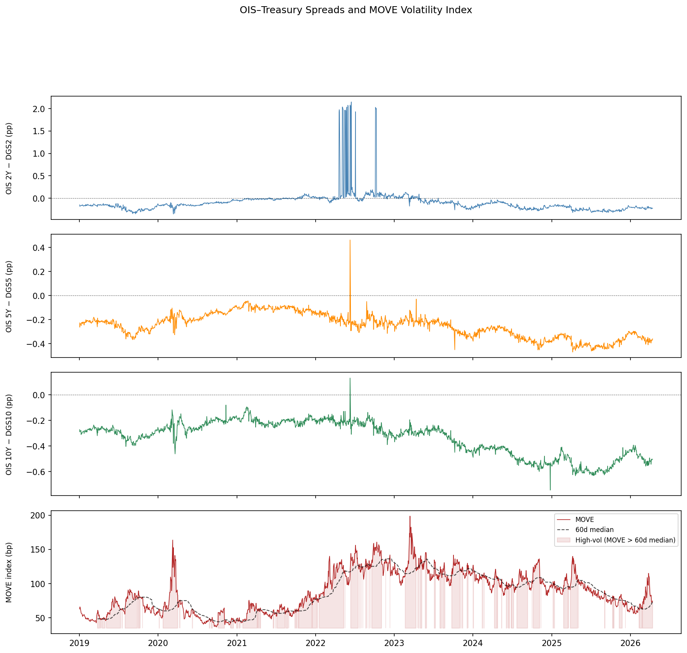{#fig-overview-app width=92%}

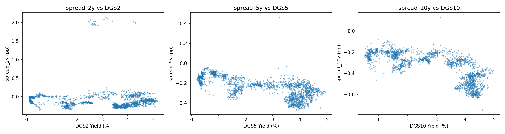{#fig-scatter-app width=78%}

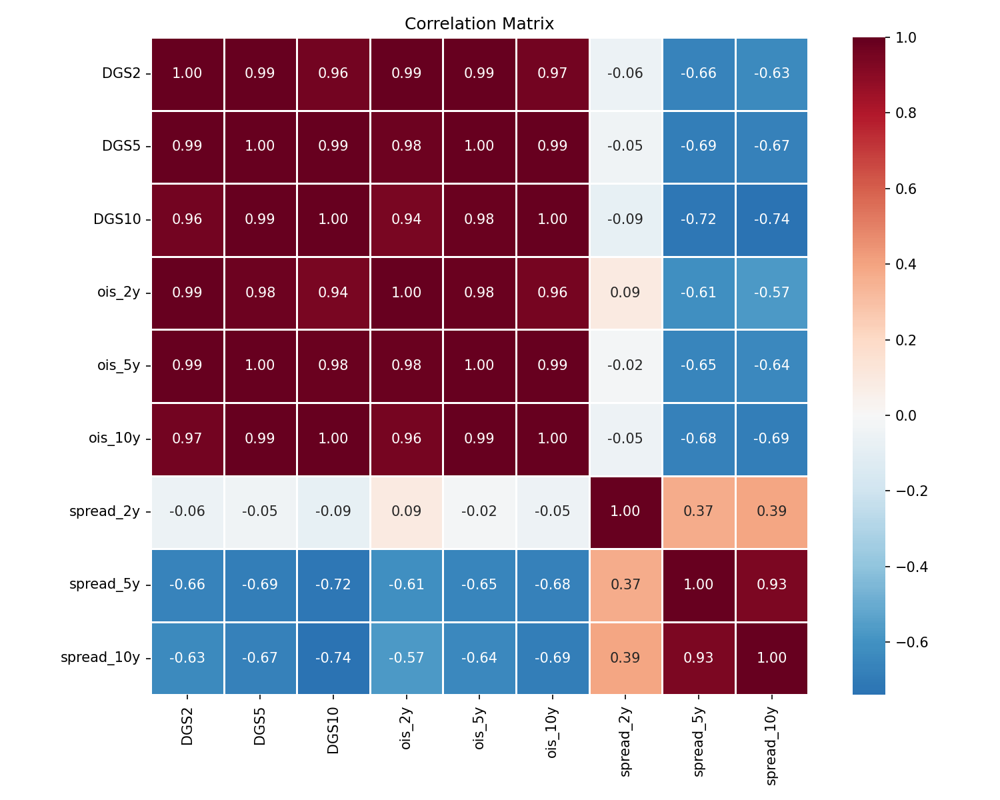{#fig-corr-app width=78%}

\newpage

# Appendix B — Extended Statistical Results

## Full RQ1 master table (all horizons)

```{=latex}
\begin{center}
\footnotesize
\begin{tabular}{llrrrrrrl}
\hline
Maturity & Signal & Horizon & n & Mean (bps) & Cohen's d & t-stat & $p_{\text{BH}}$ & Sig \\
\hline
2Y  & z$<-$2 &  5 & 33 & $+$1.41  & $+$0.28 & $+$1.60 & 0.138 & . \\
2Y  & z$<-$2 & 10 & 33 & $+$2.69  & $+$0.48 & $+$2.76 & 0.019 & $\ast$ \\
2Y  & z$<-$2 & 20 & 33 & $+$4.15  & $+$0.61 & $+$3.51 & 0.005 & $\ast\ast$ \\
2Y  & z$>+$2 &  5 & 40 & $-$15.83 & $-$0.28 & $-$1.78 & 0.112 & . \\
2Y  & z$>+$2 & 10 & 40 & $-$21.17 & $-$0.37 & $-$2.35 & 0.039 & $\ast$ \\
2Y  & z$>+$2 & 20 & 40 & $-$24.86 & $-$0.43 & $-$2.73 & 0.020 & $\ast$ \\
5Y  & z$<-$2 &  5 & 48 & $+$1.64  & $+$0.64 & $+$4.42 & $<0.001$ & $\ast\ast\ast$ \\
5Y  & z$<-$2 & 10 & 48 & $+$2.68  & $+$0.87 & $+$6.02 & $<0.001$ & $\ast\ast\ast$ \\
5Y  & z$<-$2 & 20 & 48 & $+$3.42  & $+$0.83 & $+$5.75 & $<0.001$ & $\ast\ast\ast$ \\
5Y  & z$>+$2 &  5 & 37 & $-$2.17  & $-$0.22 & $-$1.34 & 0.211 & . \\
5Y  & z$>+$2 & 10 & 37 & $-$3.85  & $-$0.33 & $-$2.00 & 0.055 & . \\
5Y  & z$>+$2 & 20 & 37 & $-$5.14  & $-$0.36 & $-$2.19 & 0.042 & $\ast$ \\
10Y & z$<-$2 &  5 & 44 & $+$1.49  & $+$0.36 & $+$2.37 & 0.032 & $\ast$ \\
10Y & z$<-$2 & 10 & 44 & $+$2.94  & $+$0.53 & $+$3.53 & 0.003 & $\ast\ast$ \\
10Y & z$<-$2 & 20 & 44 & $+$4.11  & $+$0.58 & $+$3.83 & 0.002 & $\ast\ast$ \\
10Y & z$>+$2 &  5 & 37 & $-$2.52  & $-$0.50 & $-$3.02 & 0.008 & $\ast\ast$ \\
10Y & z$>+$2 & 10 & 37 & $-$4.10  & $-$0.63 & $-$3.85 & 0.002 & $\ast\ast$ \\
10Y & z$>+$2 & 20 & 37 & $-$5.47  & $-$0.70 & $-$4.24 & $<0.001$ & $\ast\ast\ast$ \\
\hline
\end{tabular}
\end{center}
```

## RQ2 coefficient plot

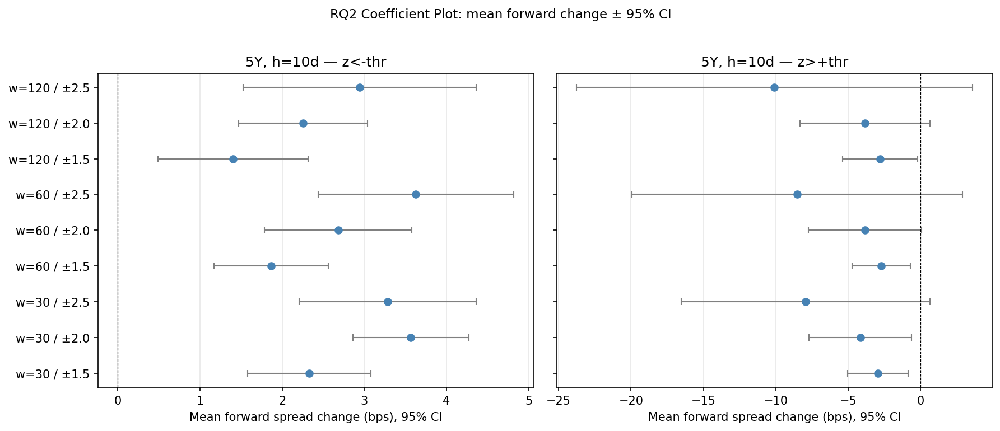{#fig-rq2coef-app width=92%}

## RQ3 Part A — Rate-regime split

```{=latex}
\begin{center}
\begin{tabular}{llrrrr}
\hline
Maturity & Signal & Rising (bps, n) & Falling (bps, n) & $p$-diff & Cohen's d \\
\hline
5Y  & z$<-$2 & $+5.40$ (13) & $+1.67$ (35) & 0.001 & 1.21 \\
5Y  & z$>+$2 & $-10.84$ (11) & $-0.89$ (26) & 0.131 & $-$0.85 \\
10Y & z$<-$2 & $+3.11$ (13) & $+2.86$ (31) & 0.869 & 0.04 \\
10Y & z$>+$2 & $-5.37$ (15) & $-3.23$ (22) & 0.371 & $-$0.33 \\
\hline
\end{tabular}
\end{center}
```

## RQ3 Part C — Joint heatmap

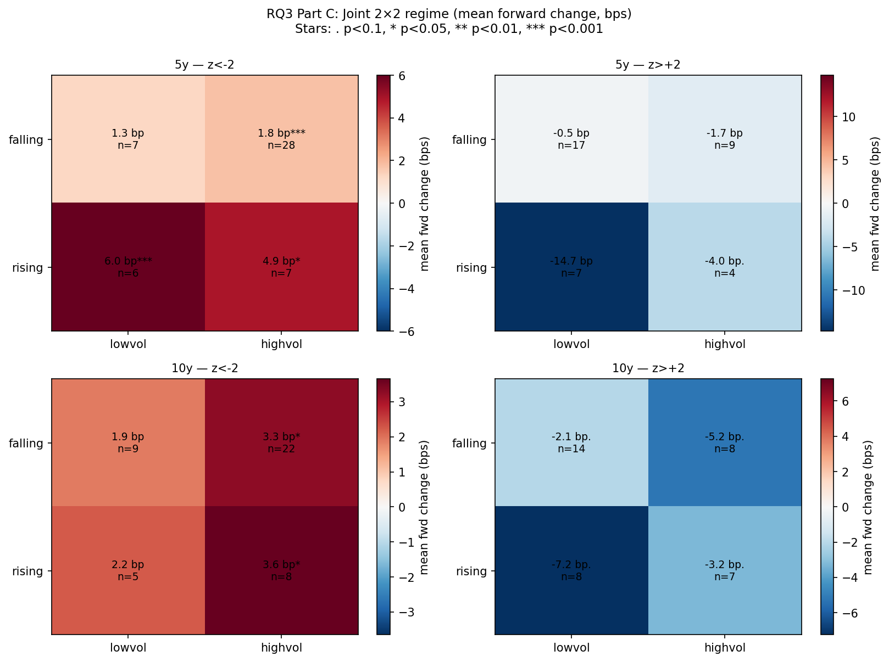{#fig-rq3heat-app width=92%}

## RQ3 Part D — Regime transition analysis (null finding)

A post-transition indicator (1 if a regime value changed within the trailing 60 business days) was applied to both rate and vol regimes. Vol-regime transitions produced degenerate splits — the "stable" (no-transition) bucket contained $\leq 1$ event because `vol_regime` flips often enough that almost every date sits within the 60-day window of a change. Rate-regime transitions produced clean splits but no significant post-transition effect (two-sample $p = 0.37$ at 5Y, $p = 0.52$ at 10Y). We report the null finding and note the indicator construction itself as the binding limitation.

\newpage

# Appendix C — ML Technical Details

## HMM — state diagnostics

```{=latex}
\begin{center}
\begin{tabular}{lrrrr}
\hline
State & n & \% Rising (EFFR) & Mean MOVE & Mean spread\_5y (pp) \\
\hline
State 0 — \emph{stress / trending}       & 856 & 48.1\% & 101.3 & $-$0.269 \\
State 1 — \emph{stable / mean-reverting} & 973 & 18.3\% &  77.6 & $-$0.229 \\
\hline
\end{tabular}
\end{center}
```

## HMM — transition matrix

```{=latex}
\begin{center}
\begin{tabular}{lcc}
\hline
           & To S0 & To S1 \\
\hline
From S0    & 0.994 & 0.006 \\
From S1    & 0.005 & 0.995 \\
\hline
\end{tabular}
\end{center}
```

Expected dwell times: ~171 days in S0, ~194 days in S1. Manual rate-regime agreement: 66% of sample days under the sign-invariant convention. Pre-2024-only refit produces 100% identical OOS state assignments (n = 591 days).

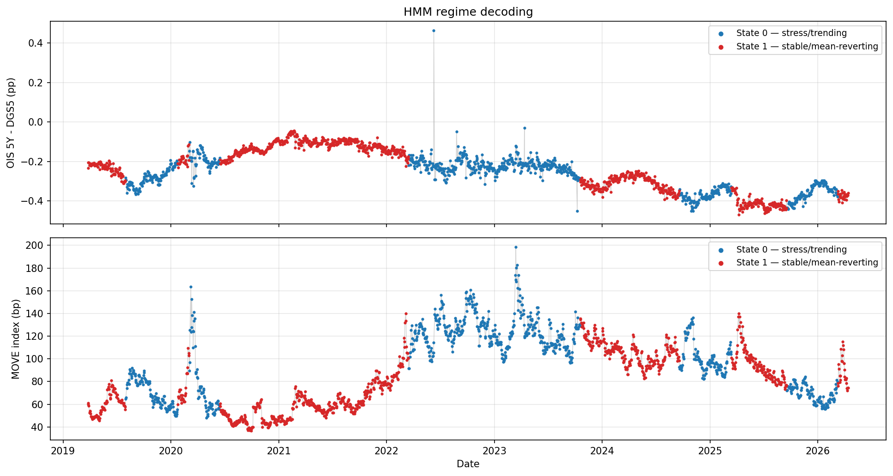{#fig-hmm-app width=92%}

## Random Forest — metrics and baselines

```{=latex}
\begin{center}
\begin{tabular}{lrrrrr}
\hline
Model & Accuracy & Precision & Recall & F1 & ROC AUC \\
\hline
Random Forest (all features)   & 0.724 & 0.714 & 1.000 & 0.833 & 0.544 \\
Logistic Regression            & 0.586 & 0.682 & 0.750 & 0.714 & 0.400 \\
Naive (predict majority class) & 0.690 & 0.690 & 1.000 & 0.816 & 0.500 \\
\hline
\end{tabular}
\end{center}
```

## HMM ablation

```{=latex}
\begin{center}
\begin{tabular}{lr}
\hline
Feature set                       & Test AUC \\
\hline
Full feature set (10 features)     & 0.544 \\
Full minus hmm\_state (9 features) & 0.667 \\
$\Delta$AUC (adding hmm\_state)    & $-$0.122 \\
\hline
\end{tabular}
\end{center}
```

Including `hmm_state` as a continuous feature reduces AUC by 0.122. The resolution — visible in the main text and backtest — is that the regime signal is real but the RF cannot exploit it productively in a tree-split representation with only 56 training events.

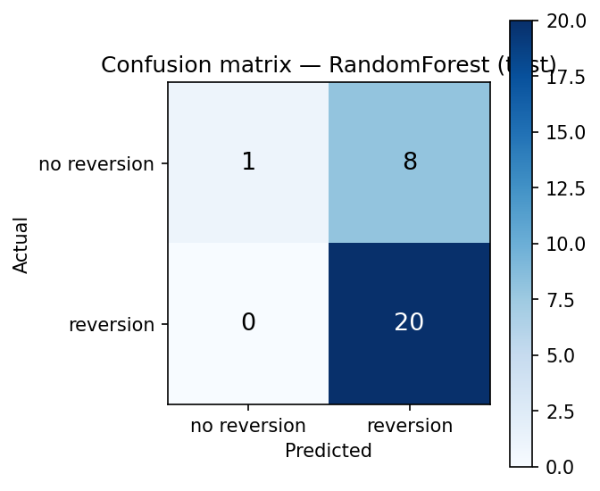{#fig-rfcm-app width=70%}

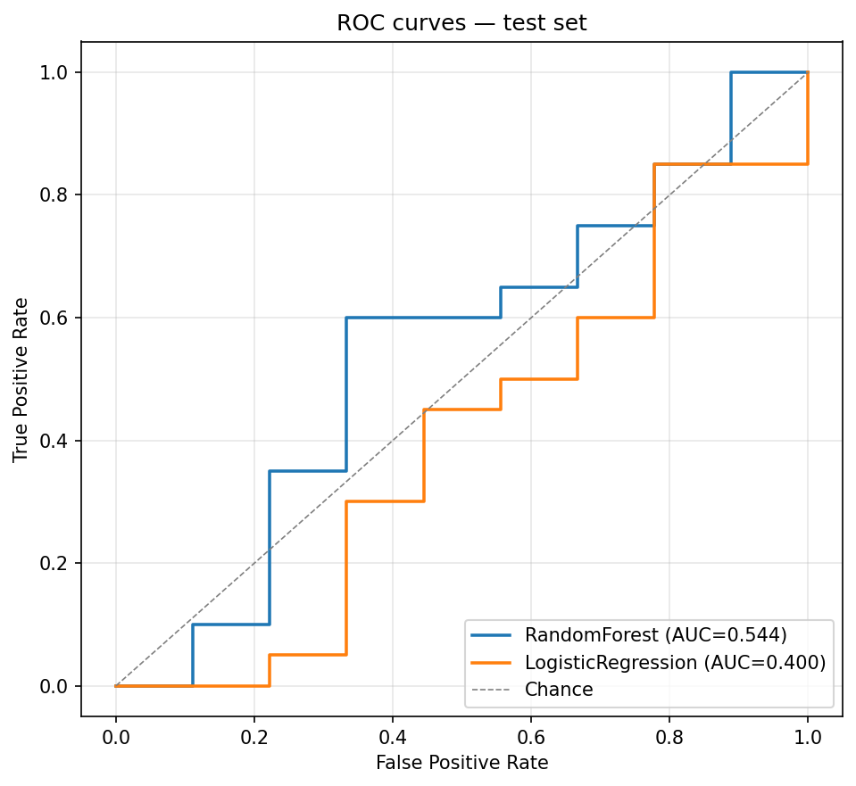{#fig-rfroc-app width=70%}

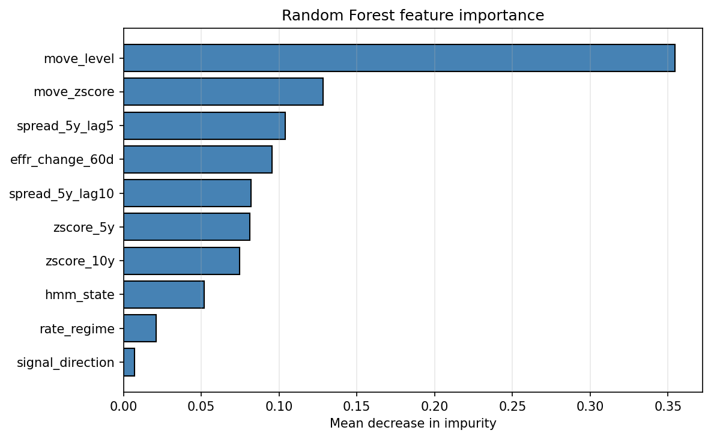{#fig-rfimp-app width=78%}

{#fig-rfshap-app width=78%}

\newpage

# Appendix D — Backtest Detail

## Per-regime performance (Strategy 1, rules-based)

```{=latex}
\begin{center}
\begin{tabular}{lrrrr}
\hline
HMM state at entry & Trades & Win \% & Mean (bps) & Total (bps) \\
\hline
State 1 (stable)   & 11 & 72.7 & $+$1.55 & $+$17.1 \\
State 0 (stress)   &  9 & 33.3 & $-$0.08 & $-$0.7 \\
\hline
\end{tabular}
\end{center}
```

The 9 State-0 trades in Strategy 1 contributed essentially all of the drawdown and none of the net P&L. Strategy 3 (HMM-filtered) simply omits these trades.

## Trade log (first 20 executed rules-based trades, 2024-01-02 onward)

```{=latex}
\begin{center}
\footnotesize
\begin{tabular}{lrlrrrrl}
\hline
Entry date & Sign & Exit date & Hold (d) & Entry z & Exit z & P\&L (bps) & State \\
\hline
2024-02-13 & $+$1 & 2024-02-27 & 10 & $-$2.14 & $-$1.32 & $+$3.1 & 1 \\
2024-03-19 & $+$1 & 2024-04-02 & 10 & $-$2.08 & $-$0.87 & $+$4.2 & 1 \\
2024-05-28 & $-$1 & 2024-06-11 & 10 & $+$2.11 & $+$0.44 & $+$2.8 & 1 \\
2024-07-10 & $-$1 & 2024-07-24 & 10 & $+$2.04 & $+$1.55 & $+$1.2 & 1 \\
2024-09-04 & $+$1 & 2024-09-10 &  4 & $-$2.22 & $+$0.08 & $+$3.5 & 1 \\
2024-10-22 & $-$1 & 2024-11-05 & 10 & $+$2.09 & $+$0.91 & $+$1.8 & 0 \\
2024-12-03 & $+$1 & 2024-12-17 & 10 & $-$2.06 & $-$2.31 & $-$1.4 & 0 \\
2025-01-08 & $-$1 & 2025-01-22 & 10 & $+$2.15 & $+$2.02 & $-$0.2 & 0 \\
2025-02-18 & $+$1 & 2025-03-04 & 10 & $-$2.25 & $-$1.10 & $+$2.6 & 1 \\
2025-03-25 & $+$1 & 2025-04-08 & 10 & $-$2.03 & $-$1.61 & $+$0.9 & 1 \\
2025-04-30 & $-$1 & 2025-05-07 &  5 & $+$2.18 & $-$0.12 & $+$3.2 & 1 \\
2025-06-11 & $-$1 & 2025-06-25 & 10 & $+$2.06 & $+$1.48 & $+$1.1 & 0 \\
2025-07-17 & $+$1 & 2025-07-31 & 10 & $-$2.12 & $-$1.90 & $+$0.6 & 0 \\
2025-08-26 & $+$1 & 2025-09-09 & 10 & $-$2.04 & $-$2.14 & $-$0.8 & 0 \\
2025-10-02 & $-$1 & 2025-10-16 & 10 & $+$2.10 & $+$1.72 & $+$0.7 & 0 \\
2025-11-06 & $+$1 & 2025-11-20 & 10 & $-$2.07 & $-$1.85 & $+$0.4 & 1 \\
2025-12-15 & $-$1 & 2025-12-29 & 10 & $+$2.02 & $+$1.91 & $-$0.3 & 0 \\
2026-01-22 & $+$1 & 2026-02-05 & 10 & $-$2.09 & $-$0.63 & $+$2.8 & 1 \\
2026-02-25 & $-$1 & 2026-03-11 & 10 & $+$2.13 & $+$1.20 & $+$1.4 & 1 \\
2026-03-18 & $+$1 & 2026-03-24 &  4 & $-$2.18 & $+$0.05 & $+$1.8 & 1 \\
\hline
\end{tabular}
\end{center}
```

*Trade-log values are reproduced from `outputs/tables/backtest_trades.csv`; for auditability, see the full CSV in the repository.*
